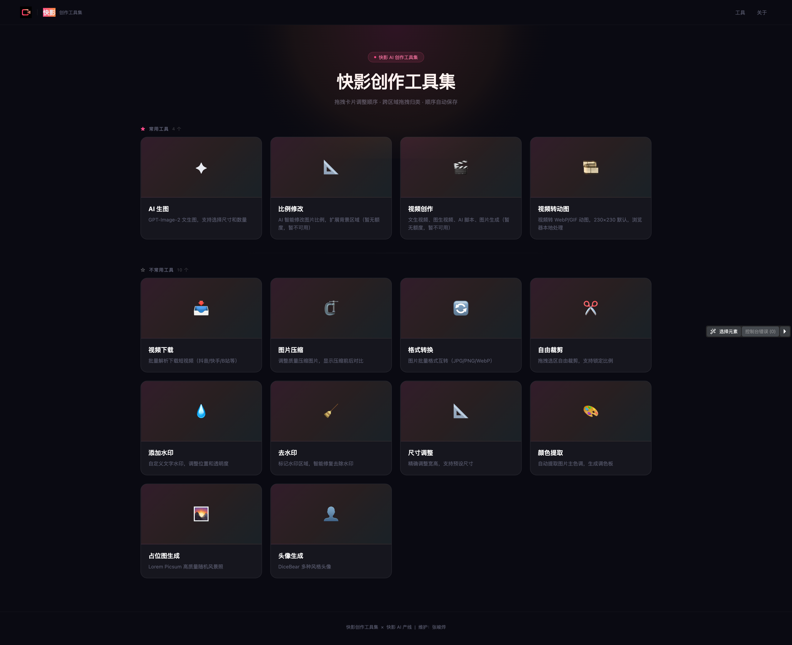

# ✨ 快影创作工具集 ✨


快手内部图像 / 视频处理工具集合。纯浏览器端处理，无需上传文件，隐私安全。

## 📸 项目截图



## ✨ 特性

- 🔒 本地处理 — 图片/视频全部在浏览器端完成，不上传服务器
- 🚀 Vite + React + TypeScript — 快速开发，类型安全
- 🎨 深色主题 — 统一的设计语言与交互体验
- 🤖 AI 生图 — GPT-Image-2 文生图 / 图生图（开发模式）
- 🎬 视频创作 — 文生视频、图生视频（Seedance）
- 📐 比例修改 — AI 智能扩展图片背景（Outpaint）
- 🧹 去水印 — ONNX 模型本地修复水印区域
- 🎞️ 视频转动图 — 视频 → WebP / GIF 动图
- 📥 视频下载 — 批量解析下载短视频
- 🗜️ 图片压缩 — 调整质量压缩，前后对比
- 🔄 格式转换 — JPG / PNG / WebP 批量互转
- ✂️ 自由裁剪 — 拖拽选区裁剪，支持锁定比例
- 💧 添加水印 — 自定义文字水印，调整位置和透明度
- 📐 尺寸调整 — 确调整宽高，支持预设尺寸
- 🎨 颜色提取 — 自动提取图片主色调，生成调色板
- 🌄 占位图生成 — Lorem Picsum 高质量随机风景照
- 👤 头像生成 — DiceBear 多种风格头像

## 🛠️ 技术栈

- Vite 5
- React 18
- TypeScript 5
- TailwindCSS 3
- React Router v6
- ONNX Runtime Web（去水印模型推理）
- FFmpeg.wasm（视频处理）
- 万擎 API（AI 生图 / 视频创作）

## 🚀 快速开始

1. 克隆项目

```bash
git clone https://github.com/erem1ka/ky-creative-tools.git
cd ky-creative-tools
```

2. 安装依赖

```bash
npm install
```

3. 启动开发服务器

```bash
npm run dev
```

4. 打开浏览器访问 `http://localhost:5173`

## 📦 构建打包

```bash
npm run build
```

## 🌐 部署

项目部署在快手 frontend-cloud 静态站点，仅内网可访问：

- **线上地址**：`https://image-tools.frontend-cloud.corp.kuaishou.com`

```bash
# 构建
npm run build

# 部署到快手 frontend-cloud
npx -y @codeflicker/frontend-cloud-cli@latest deploy
```

## 🗺️ 路线图

- [x] 图片压缩、格式转换、裁剪、水印、尺寸调整
- [x] 颜色提取、占位图生成、头像生成
- [x] 去水印（ONNX 本地推理）
- [x] 视频转动图（WebP / GIF）
- [x] 视频下载（抖音/快手/B站等）
- [x] AI 比例修改（Outpaint）
- [x] AI 视频创作（Seedance）
- [x] AI 生图（GPT-Image-2）
- [ ] 批量处理优化
- [ ] 更多 AI 模型接入

## 👤 作者

张峻烨 — 快影 AI 产线